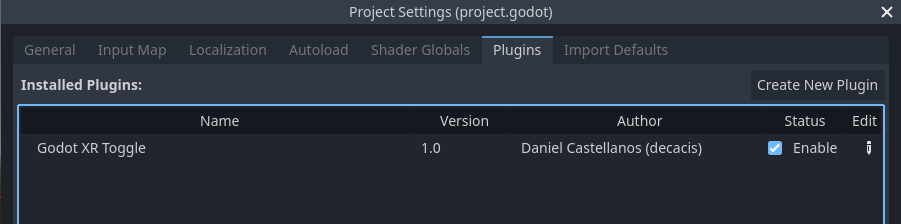
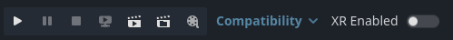
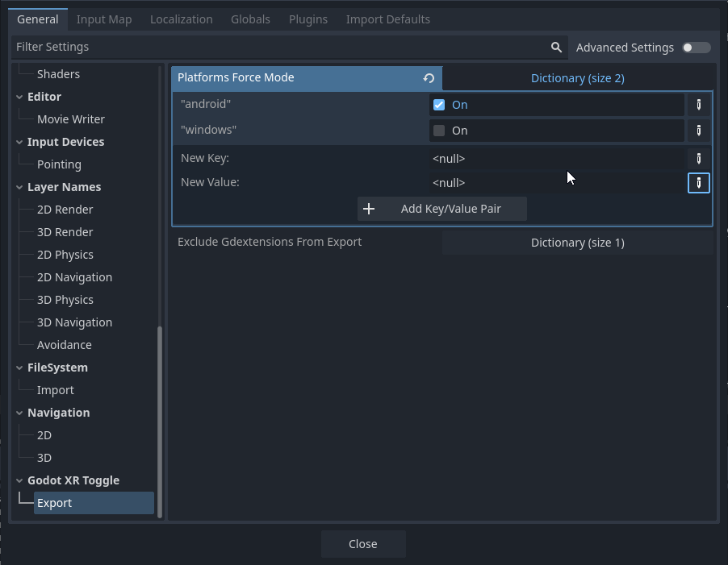
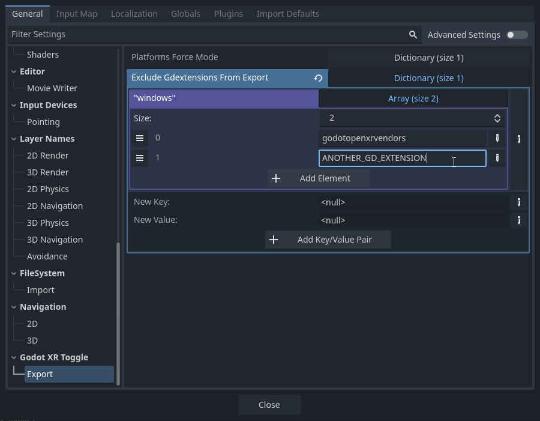

# Godot XR Toggle

The Godot XR Toggle is a simple toggle to run with VR enabled or not, from the editor.

It is recommended to keep OpenXR enabled in the project settings (`xr/openxr/enabled`) and use the toggle to enable/disable it dynamically.

This repository also includes an example of a project that can run VR and non-VR, thought the main focus is the XR Toggle plugin.

## Installing

You can add this plugin to your project using the [Asset Library](https://godotengine.org/asset-library/asset/3033). Alternatively, you can download it from the [GitHub releases page](https://github.com/decacis/Godot-XR-Toggle/releases) and just place it into your project.

Once you put the files in your project, head on to the Project Settings -> Plugins and enable the plugin there:

After enabling the plugin, you'll see the XR Toggle on the top right of the screen:

## Force toggle XR when exporting

You can force XR being enabled/disabled when exporting for certain platforms. This is useful because when you are in the editor, you could have the XR Toggle disabled, but when exporting for the Quest (android) you want to have OpenXR always enabled, so you can add the platform to the "Platforms Force Mode" section like this:

In that screenshot, when exporting for `android`, OpenXR will be enabled regardless of the current setting of the editor. If the checkbox was unchecked (like for `windows`), then it would be disabled regardless of the editor setting.

## Exclude GDExtensions when exporting

If you include the [Godot OpenXR Vendors](https://github.com/GodotVR/godot_openxr_vendors/) when you export for Windows, for example, and then try to run the game with `--xr-mode on`, the game will fail to start. Also, the vendors are not needed on desktop platforms, so it makes sense to exclude them from the export.

In the screenshot you can see that for the platform `windows` I added an `Array` with two `String` entries. One for `godotopenxrvendors` which is the folder that contains the Godot OpenXR Vendors and one example "ANOTHER_GD_EXTENSION".
